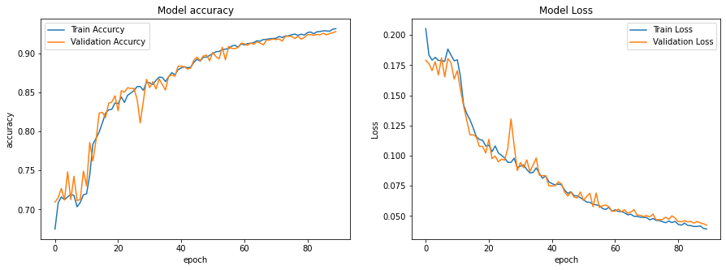

# Hair Segmentation Using U-NET

Implementation Of CNN U-NET Architecture With Keras And Tensorflow :snake::eyes:

[CelebA-HQ](https://drive.google.com/file/d/1badu11NqxGf6qM3PTTooQDJvQbejgbTv/view?usp=sharing) Dataset Was Used To Get Hair Masks And Train The DNN on New Dataset [HairDataset-Celeba](https://drive.google.com/file/d/1GWfpn3J9OSiWYkUE5eZJhO7iRZxRyQ01/view?usp=sharing)
The Dataset That Used In This Project Has 12187 Images And it's Masks.
You Can Find Indices File [Here](https://drive.google.com/file/d/1GCraDuKHRezh-_Ezuo6Lj6JKLnymfZ_Z/view?usp=sharing)

---
Accurcy & Loss Curves

---
Also The Trained Model Is Available [Here](https://drive.google.com/file/d/1Mbo5CbEz-iKb1SCJQm-pxBQ4ElJ26Yf5/view?usp=sharing)

Enjoy :smile::yellow_heart:
